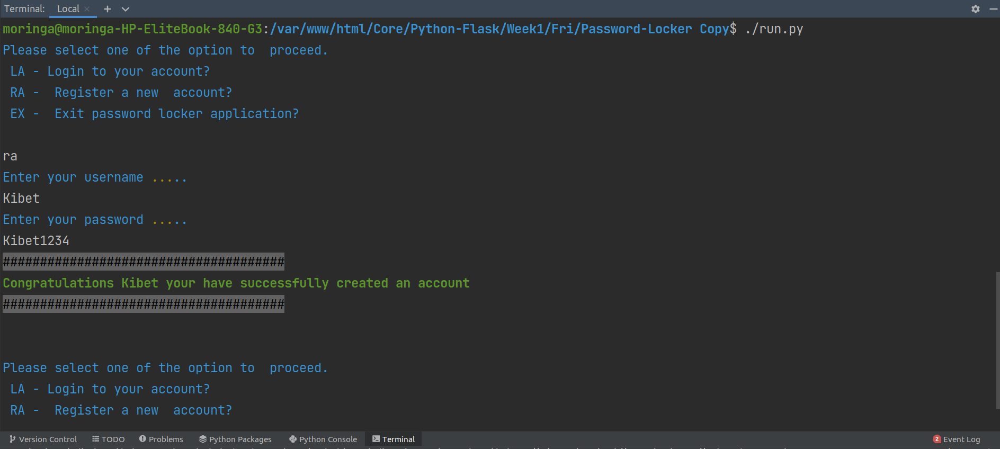

# Password Locker 
## By David Rono 

## Description
Password locker is a python  application that runs on the terminal 
and lets users create and login to their personal accounts. 
They then create accounts and store their details or credentials 
such as account_name,username and passwords on the application. 

## Project requirements
 * Git 
 * Terminal 
 * Python3
 * Pip

## Installation instructions
 * git clone https://github.com/DavidKibetRono/Password-Locker
 * cd Password-Locker 
 * on terminal, chmod +x run.py
 * on terminal, ./run.py

## Technologies used 
 * Python3.8

## Contact Information
 * Email - kibetdavidro@gmail.com
 * Phone number - +254 728234794

## Screenshot

## MIT licence

Copyright (c) 2022 David Rono 

Permission is hereby granted, free of charge, to any person obtaining
a copy of this software and associated documentation files (the
"Software"), to deal in the Software without restriction, including
without limitation the rights to use, copy, modify, merge, publish,
distribute, sublicense, and/or sell copies of the Software, and to
permit persons to whom the Software is furnished to do so, subject to
the following conditions:

The above copyright notice and this permission notice shall be
included in all copies or substantial portions of the Software.

THE SOFTWARE IS PROVIDED "AS IS", WITHOUT WARRANTY OF ANY KIND,
EXPRESS OR IMPLIED, INCLUDING BUT NOT LIMITED TO THE WARRANTIES OF
MERCHANTABILITY, FITNESS FOR A PARTICULAR PURPOSE AND
NONINFRINGEMENT. IN NO EVENT SHALL THE AUTHORS OR COPYRIGHT HOLDERS BE
LIABLE FOR ANY CLAIM, DAMAGES OR OTHER LIABILITY, WHETHER IN AN ACTION
OF CONTRACT, TORT OR OTHERWISE, ARISING FROM, OUT OF OR IN CONNECTION
WITH THE SOFTWARE OR THE USE OR OTHER DEALINGS IN THE SOFTWARE.

